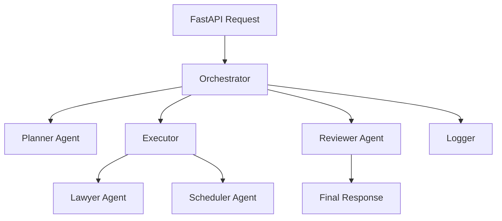

# 🤖 AI Staff Scheduler

[](https://opensource.org/licenses/MIT)
[](https://www.python.org/downloads/)
[](https://fastapi.tiangolo.com/)

An intelligent, **agentic AI** workforce scheduling system powered by **xAI's Grok** models. Specialized AI agents collaborate to generate fair, compliant, and optimized staff schedules for complex real-world constraints.

---

## Important Notice

This is a personal side project developed independently in my free time. It has no connection to any employer or client work and does not contain or derive from any proprietary code.

---

## Table of Contents

- [Overview](#overview)
- [Key Features](#key-features)
- [Architecture](#architecture)
- [Agent Roles](#agent-roles)
- [Installation](#installation)
- [Configuration](#configuration)
- [Usage](#usage)
- [API Reference](#api-reference)
- [Data Models](#data-models)
- [System Workflow](#system-workflow)
- [Testing](#testing)
- [Project Structure](#project-structure)
- [Troubleshooting](#troubleshooting)
- [Contributing](#contributing)
- [License](#license)

---

## Overview

**AI Staff Scheduler** leverages **multi-agent architecture** with xAI's Grok to tackle complex scheduling challenges. Agents collaborate intelligently to:

- Analyze requirements
- Validate compliance
- Generate optimal assignments
- Review and refine results

Built with **FastAPI** for a clean, async API and full interactive documentation.

---

## Key Features

### 🧠 Multi-Agent Collaboration
- Planner → Strategizes approach
- Lawyer → Ensures legal/compliance rules
- Scheduler → Creates optimized assignments
- Reviewer → Quality assurance and scoring

### 🎯 Smart Scheduling
- Certification matching
- Workload balancing (nights, weekends, holidays)
- Preference consideration
- Conflict detection
- Capacity management

### ⚖️ Compliance & Fairness
- Labor law checks
- Fair distribution
- Vacation handling
- Rest periods
- Max hours enforcement

### 🔄 Reliability
- Fallback logic
- Confidence scoring
- Detailed logging
- Error recovery

---

## Architecture

Central orchestrator coordinates specialized agents:



### Communication Flow
1. Request → Orchestrator
2. Planner creates execution plan
3. Executor runs tools (Lawyer / Scheduler)
4. Reviewer assesses quality
5. Orchestrator curates response

---

## Agent Roles

### Orchestrator (`orchestrator.py`)
Coordinates workflow, aggregates results, handles fallbacks.

### Planner Agent (`planner.py`)
Analyzes complexity and creates step-by-step plan (low temperature for focus).

### Executor (`executor.py`)
Runs plan steps, calls tools, tracks metadata.

### Lawyer Agent (`lawyer.py`)
Validates constraints (certifications, overlaps, workload, vacations). Very precise (temperature 0.2).

### Scheduler Agent (`scheduler.py`)
Generates assignments with confidence scores. Balances creativity and consistency (temperature 0.5).

### Reviewer Agent (`reviewer.py`)
Evaluates coverage, fairness, compliance. Provides quality score (0-1).

---

## Installation

### Prerequisites
- Python 3.8+ (tested on 3.12+)
- xAI API key (get at [x.ai/api](https://x.ai/api))

```bash
git clone https://github.com/pumasoft/ai-staff-scheduler.git
cd ai-staff-scheduler

python -m venv venv
source venv/bin/activate  # Windows: venv\Scripts\activate

pip install -r requirements.txt
```

Core dependencies:
- fastapi
- uvicorn
- openai (>=1.51.0) — used for xAI compatibility
- pydantic
- loguru
- python-dotenv

---

## Configuration

Copy and edit `.env`:

```bash
cp .env.example .env
```

```env
XAI_API_KEY=your_xai_api_key_here
ENABLE_FILE_LOGGING=false
LOG_LEVEL=INFO
```

---

## Usage

### Run Server

Development:
```bash
uvicorn main:app --reload
```

Production:
```bash
uvicorn main:app --host 0.0.0.0 --port 8000 --workers 4
```

API: http://localhost:8000  
Docs: http://localhost:8000/docs (Swagger) / http://localhost:8000/redoc

### Example Request (cURL)

```bash
curl -X POST "http://localhost:8000/schedule" \
  -H "Content-Type: application/json" \
  -d @data/sample_request.json
```

Sample data in `data/` folder.

---

## API Reference

### POST /schedule

**Request Body** (ScheduleRequest):
```json
{
  "employees": [/* array of Employee objects */],
  "tasks": [/* array of Task objects */],
  "constraints": { /* optional */ }
}
```

**Response** (ScheduleResponse):
```json
{
  "assignments": [/* array of Assignment objects */],
  "success": true,
  "warnings": [],
  "metadata": {
    "quality_score": 0.92,
    "plan_strategy": "validate-first"
  }
}
```

### GET /
Health check → API info

### GET /health
Detailed status

---

## Data Models

### Employee
```python
{
  "employee_id": int,
  "name": str,
  "certifications": list[int],
  "preferences": list[int],
  "vacation_days_remaining": int,
  "worked_nights": int,
  "worked_weekends": int,
  "worked_holidays": int
  # ... additional tracking fields
}
```

### Task
```python
{
  "task_id": int,
  "category": int,
  "required_certifications": list[int],
  "customer_capacity": int,
  "required_capacity_per_staff": int,
  "start": "ISO datetime",
  "end": "ISO datetime"
}
```

### Assignment
```python
{
  "task_id": int,
  "employee_id": int,
  "employee_name": str,
  "confidence": float  # 0.0-1.0
}
```

---

## System Workflow

1. Validation
2. Planning phase
3. Execution (lawyer + scheduler tools)
4. Review phase
5. Curation & response

Supports multiple strategies (validate-first, schedule-first, iterative).

---

## Testing

```bash
pytest                # All tests
pytest -v             # Verbose
pytest --cov=scheduler  # Coverage
```

---

## Project Structure

```
ai-staff-scheduler/
├── data/                  # Sample JSON files
├── logs/                  # Log output (if enabled)
├── scheduler/
│   ├── __init__.py
│   ├── executor.py
│   ├── lawyer.py
│   ├── logger.py
│   ├── models.py
│   ├── orchestrator.py
│   ├── planner.py
│   ├── reviewer.py
│   ├── scheduler.py
│   └── utils.py
├── tests/
├── .env.example
├── main.py                # FastAPI app
├── requirements.txt
└── README.md
```

---

## Troubleshooting

- **API key error** → Check `.env` and xAI console
- **Connection issues** → Verify internet and API status
- **Low quality** → Simplify constraints or add more qualified employees
- Enable `LOG_LEVEL=DEBUG` for detailed traces

---

## Contributing

Contributions welcome!

1. Fork repo
2. Create feature branch
3. Add tests
4. Run `pytest`
5. Open Pull Request

---

## License

MIT License — see [LICENSE](LICENSE)

---

## Author

**George Dryser**  

---
